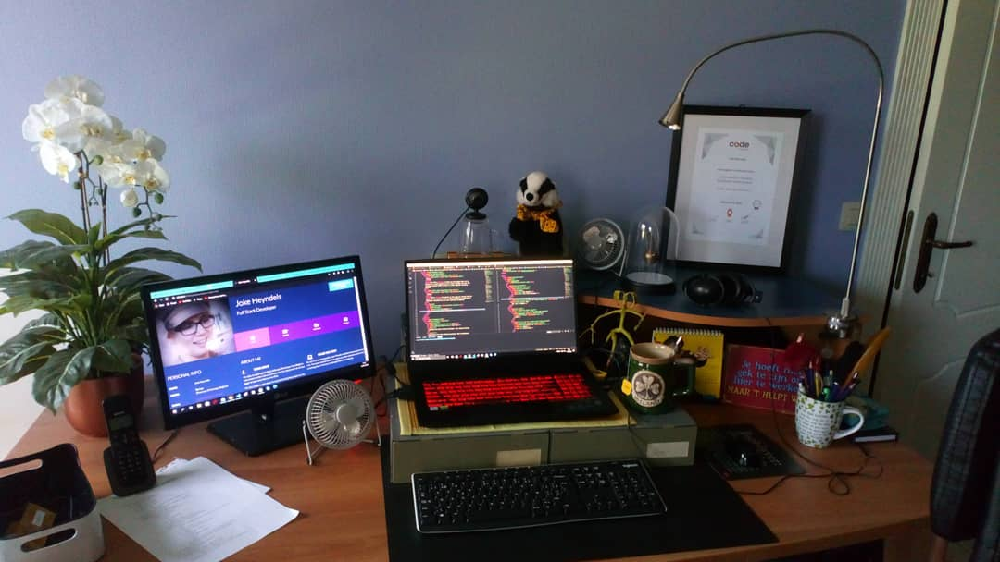

# Joke Heyndels (Wings30306)

## FactFile

- Pronouns: she/her 🚺
- Country: Belgium 🇧🇪
- Coding since 2018 👩‍💻
- Open to work: ✔️

## AboutMe

I'm Joke, a Full Stack Software Developer from Belgium. I am a hard worker with a lot of attention to detail and I am always eager to learn and improve my skills.

I'm very creative, and when I'm not channeling that creativity into a project I love to knit, draw and write poems and stories.

I also love helping others. As such, I volunteered at CoderDojo Lier as a coach for a cool gang of young coders aged 7 to 18. I also held a position of Slack Channel Lead twice while I was studying. This was followed with four years as a tutor and instructor creating lessons for HTML, CSS, Bootstrap, Python and Django. 

I'd love to find a similar position, passing on my knowledge to new coders through online learning, or a socially relevant software development position where I can help improve the lives of others through code. 

**Feel free to get in touch!**

## MySkills
Learning never stops, but so far I've learned how to work with:

- HTML
- CSS
- Bootstrap
- JavaScript
- JQuery
- Python
- Flask
- Django
- React

Non-programming skills:

- Can work alone or as part of a team
- A lot of attention to detail
- Quick learner

## ContactMe
📧 [Email me](mailto:jo_hannah@outlook.com)

## FunFact
🧙‍♀️ I'm a complete Potterhead and was sorted into Hufflepuff House on Pottermore.

⌨️ For me, programming is like magic with a keyboard instead of a wand. I'm loving it! 🤩

🪄 I solemnly swear I support trans rights 🪄
