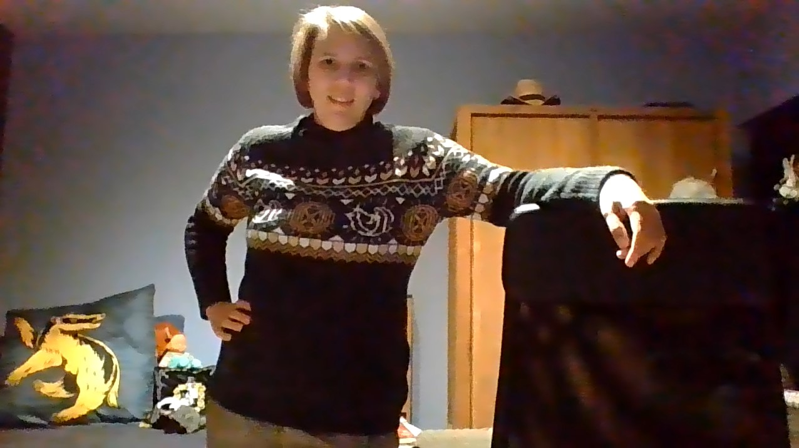

# Joke Heyndels (Wings30306)

## FactFile

- Pronouns: she/her 🚺
- Country: Belgium 🇧🇪
- Coding since 2018 👩‍💻
- Open to work: ✔️

## AboutMe
I'm Joke, a Junior Full Stack Software Developer from Belgium. I am a hard worker with a lot of attention to detail and I am always eager to learn and improve my skills.

I'm very creative, and when I'm not channeling that creativity into a project I love to knit, draw and write poems and stories.

I also love helping others grow their skills. As such, I volunteer at CoderDojo Lier as a coach for a cool gang of young coders aged 7 to 18. I also held a position of Slack Channel Lead twice while I was studying. I'm still active in the Code Institute community helping others even now I've graduated.

## MySkills
Learning never stops, but so far I've learned how to work with:

- HTML
- CSS
- Bootstrap
- JavaScript
- JQuery
- Python
- Flask
- Django
- C#
- .NET Core
- ASP.​NET

Non-programming skills:

- Can work alone or as part of a team
- A lot of attention to detail
- Quick learner

## ContactMe
📧 [Email me](mailto:jo_hannah@outlook.com)

## FunFact
🧙‍♀️ I'm a complete Potterhead and was sorted into Hufflepuff House on Pottermore.

For me, programming is like magic with a keyboard instead of a wand. I'm loving it! 🤩

<!--
**Wings30306/Wings30306** is a ✨ _special_ ✨ repository because its `README.md` (this file) appears on your GitHub profile.

Here are some ideas to get you started:

- 🔭 I’m currently working on ...
- 🌱 I’m currently learning ...
- 👯 I’m looking to collaborate on ...
- 🤔 I’m looking for help with ...
- 💬 Ask me about ...
- 📫 How to reach me: ...
- 😄 Pronouns: ...
- ⚡ Fun fact: ...
-->
